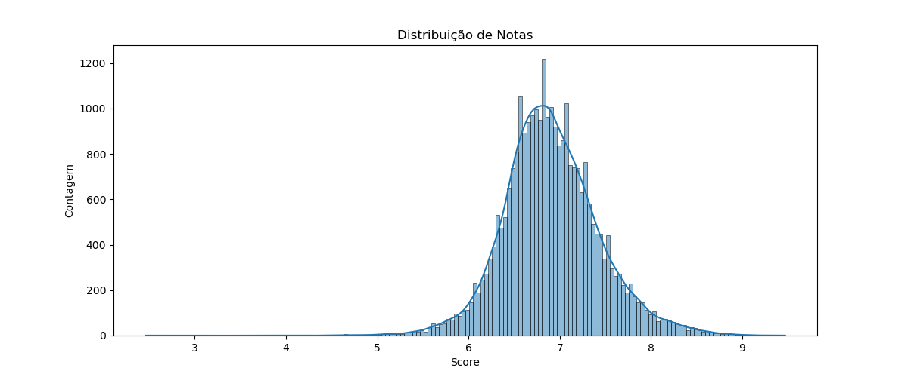
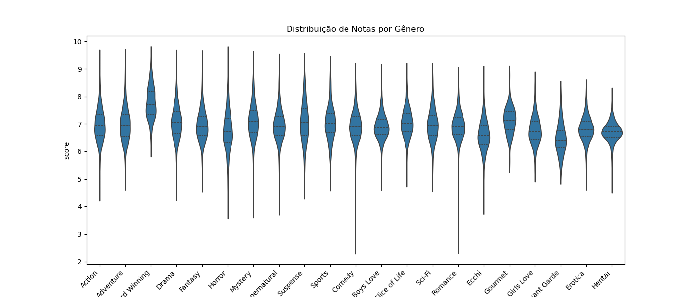
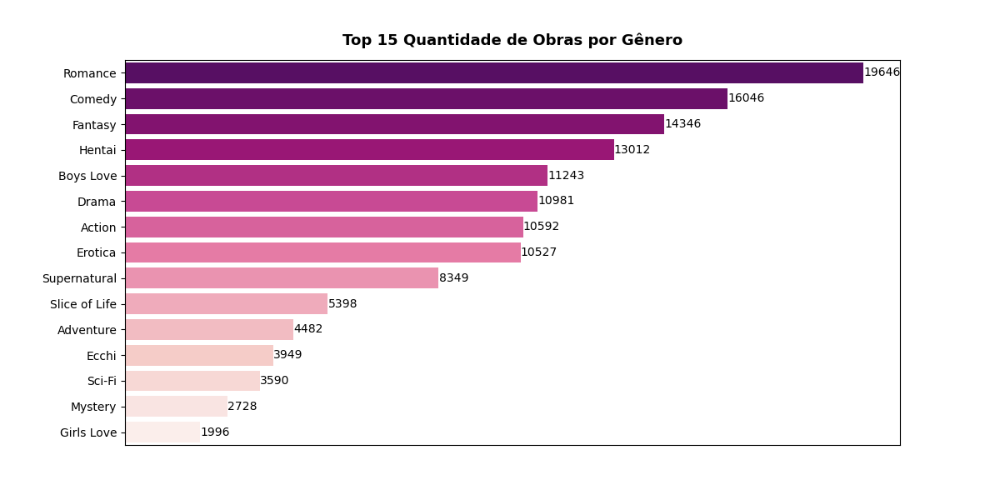

# Projeto de Analise de Dados de Mangas do MyAnimeList
Projeto de Análise de Dados com dados extraídos do MyAnimeList utilizando Python e Jupyter Notebook.
explorando um dataset com registros de obras com foco em entender padrões, distribuições e responder perguntas de análises.

## Notebooks
1. Pré-Processamento
   * Leitura do dataset.
   * Limpeza de dados: checagem de duplicatas, valores negativos, valores ausêntes e preenchimento de valores ausêntes.
   * Converão de tipos.
   * Criação de novos atributos.
3. Análise
   * Exploração de variáveis: notas, número de pessoas que deram nota, número de capitulos, número de volumes, demografias, temas, gêneros e autores.
   * Criação de gráficos de distribuição, os mais populares, coocorrência de gêneros e outros.
   * Visualização de histogramas, boxplots, countplots, gráfico de barras, gráfico de linha e heatmap.
   * Insights sobre os dados históricos.
## Dataset
[Dataset utilizado](https://www.kaggle.com/datasets/hamzaashfaque1999/myanimelist-scraped-data/) retirado do Kaggle.

O dataset de animes possui as seguintes colunas: 
* **id**: Identificador único atribuído pelo site.
* **link**: URL do registro.
* **title_name**: Título do registro.
* **score**: Média ponderada das notas dadas pelos usuários.
* **scored_by**: Número de pessoas que avaliaram o registro.
* **ranked**: Classificação do registro.
* **popularity**: Ranking de popularidade em comparação com outras obras, sendo 1º o mais popular, decidido pelo número de membros.
* **members**: Número de usuários que interagiram com o registro.
* **favorited**: Número de usuários que favoritaram a obra.
* **synonymns**: Outros títulos pelos quais a obra é conhecido.
* **japanese_name**: Nome em japonês.
* **english_name**: Nome em inglês.
* **german_name**: Nome em alemão.
* **french_name**: Nome em francês.
* **spanish_name**: Nome em espanhol.
* **item_type**: Idica se o registro é sobre mangá, light novel, novel, manhwa, etc.
* **status**: Indica se o anime está atualmente no ar, finalizado ou ainda não foi exibido.
* **themes**: Temas presentes no anime.
* **demographic**: Público-alvo ao qual o anime é direcionado.
* **volumes**: Quantidade de volumes da obra.
* **chapters**: Quantidade de capitulos da obra.

## Alguns Gráficos
.png)

